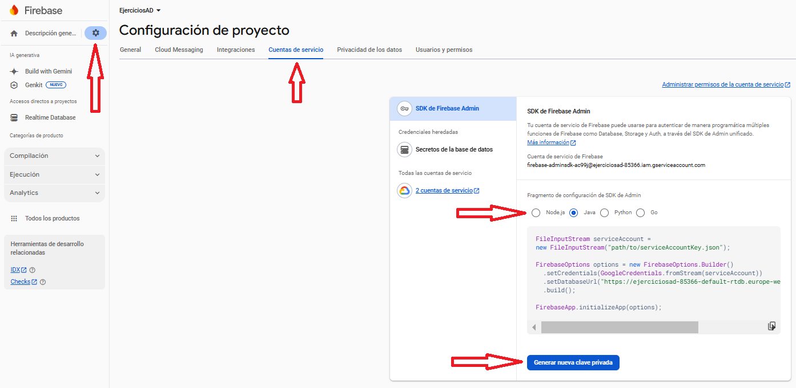

# Realtime Database (RD)

Aunque el objetivo es utilizarlo desde nuestro entorno de programación, siempre resulta útil manipular los datos directamente desde el propio entorno de Firebase.

El siguiente vídeo corresponde a una versión anterior de Firebase, pero sigue siendo igualmente válido.

<iframe src="https://slides.com/aliciasalvador/t7_firebase_inserirdades/embed" width="576" height="420" title="Copy of T7_Firebase_InserirDades" scrolling="no" frameborder="0" webkitallowfullscreen mozallowfullscreen allowfullscreen></iframe>

El entorno que nos ofrece Firebase será suficiente. Podremos visualizar los datos que hayamos introducido en todas nuestras aplicaciones, así como editarlos, es decir: añadir, modificar y eliminar.

Recordemos que podemos utilizar dos versiones:

  * **Realtime Database**
  * **Cloud Firestore**

## 🔹RD: Utilización desde el entorno de Firebase

Haremos especial mención al hecho de que lo que guardamos es un documento JSON.
Incluso podremos descargarlo (exportarlo) o subirlo (importarlo) como un documento.
Eso sí, la operación de importación elimina los datos anteriores, lo que demuestra que solo podemos almacenar un único documento JSON.

Este es el contenido del archivo Empleats.json que se muestra en el vídeo. Está formateado para facilitar su lectura, aunque en realidad no importaría que todo estuviera en una sola línea.

Lo tenéis disponible en el aula virtual para que podáis importarlo.

    {  
        "empresa": {  
            "empleat": [  
            {  
                "num": 1,  
                "nom": "Andreu",  
                "departament": 10,  
                "edat": 32,  
                "sou": 1000  
            },  
            {  
                "num": 2,  
                "nom": "Bernat",  
                "departament": 20,  
                "edat": 28,  
                "sou": 1200  
            },  
            {  
                "num": 3,  
                "nom": "Clàudia",  
                "departament": 10,  
                "edat": 26,  
                "sou": 1100  
            },  
            {  
                "num": 4,  
                "nom": "Damià",  
                "departament": 10,  
                "edat": 40,  
                "sou": 1500  
            }  
        ]  
        }  
        }

Ya habéis visto que al importar Empleats.json se han perdido los demás datos.
Volved a añadir el par clave-valor a1 (por ejemplo, con el valor Hola), ya que, al ser una estructura muy sencilla, la utilizaremos en algunos ejemplos.

De este modo, nos quedará la siguiente estructura para los ejemplos posteriores:

## 🔹RD: Utilización desde IntelliJ

Para los ejemplos y ejercicios de esta parte, crearemos un proyecto llamado Tema8, con los siguientes paquetes:
exemples_realtimedatabase, exemples_cloudfirestore, exemples_cloudstorage y exercicis.

### 🔹 RD-IntelliJ: Connexión des de Kotlin

**Configuración**{.azul}

Lo primero que debemos hacer es preparar nuestro proyecto para que pueda acceder a la aplicación que hemos creado en Firebase.

Desde el entorno de IntelliJ, descargaremos un archivo JSON que contiene la clave de acceso a nuestra aplicación.

Para obtenerlo, debemos ir a la configuración del proyecto y, dentro de ella, acceder a la pestaña **Cuentas de servicio** (**Service Accounts**).
Allí veremos varios ejemplos de uso (en nuestro caso nos interesa el de **Java**) y, al final de la página, encontraremos un botón para**Generar una nueva clave privada**.

Se descargará un archivo **JSON** que **deberemos guardar** en la raíz del proyecto.
Después, tal como indica el ejemplo, añadiremos el siguiente código para garantizar un acceso correcto:

    val serviceAccount = FileInputStream("access-a-dades-d119e-firebase-adminsdk-ehn3k-14a46f56f4.json")

        val options = FirebaseOptions.builder()
            .setCredentials(GoogleCredentials.fromStream(serviceAccount))
            .setDatabaseUrl("https://access-a-dades-d119e-default-rtdb.firebaseio.com/").build()

        FirebaseApp.initializeApp(options)

!!!warning "Avís"
    **No os olvidéis de sustituir el nombre del archivo JSON**.
    También debéis tener en cuenta que la URL de la base de datos será diferente para cada uno de vosotros.

El ejemplo está escrito en **Java**, por lo que tendremos que convertirlo a **Kotlin**.
Quedará de la siguiente forma (yo lo he adaptado a mi proyecto, pero recordad cambiar el nombre del archivo JSON y la URL por los vuestros):     

        val serviceAccount = FileInputStream("access-a-dades-d119e-firebase-adminsdk-ehn3k-14a46f56f4.json")

        val options = FirebaseOptions.builder()
            .setCredentials(GoogleCredentials.fromStream(serviceAccount))
            .setDatabaseUrl("https://access-a-dades-d119e-default-rtdb.firebaseio.com/").build()

        FirebaseApp.initializeApp(options)

**Referencia a la Base de Datos y a los datos concretos a los que queremos acceder**{.azul}

Debemos crear un objeto **FirebaseDatabase**, que será una **referencia a toda la Base de Datos**:

    val database = FirebaseDatabase.getInstance()

A partir de este objeto, podríamos hacer referencia a un **par clave-valor** que se encuentre en la **raíz**, como cuando habíamos creado **a1** (aunque recordad que ahora ya no existe):

    val refA1 = database.getReference("a1")

También podríamos hacer referencia a un par clave-valor que no se encuentre en la raíz de la base de datos.
Simplemente indicaríamos la ruta completa desde la raíz.

Por ejemplo, para acceder al nombre del primer empleado de la empresa que tenemos guardado, lo haríamos así:

    val empleat1 = database.getReference("empresa/empleat/0/nom")

En els casos anteriors hem optat per agafar parelles clau-valor, bé a l'arrel
o més cap a dins de l'estructura JSON. Però en definitiva és una parella clau-
valor.

També podem optar per agafar l'estructura JSON i treballar amb ella, com vam
fer en el Tema 3, quan vam treballar amb l'estructura JSON.

    val empresa = database.getReference("empresa")

De esta manera, al obtener toda la estructura, tendremos **dos formas de trabajar** posteriormente para acceder a niveles más profundos dentro de la base de datos:

- **Convertirla en objetos y arrays JSON**, y trabajar como hicimos en el *Tema 3*.  
  Es un método muy cómodo, especialmente cuando se trata de **operaciones de lectura**.

- **Trabajar directamente con los métodos de Firebase**, que nos permiten acceder tanto a **todos los nodos hijos** de una estructura como a **un nodo hijo concreto**.

Mostraremos ambos enfoques en los ejemplos posteriores.

### 🔹RD-IntelliJ: Acceso a los datos

