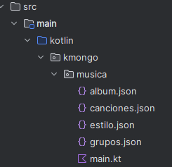
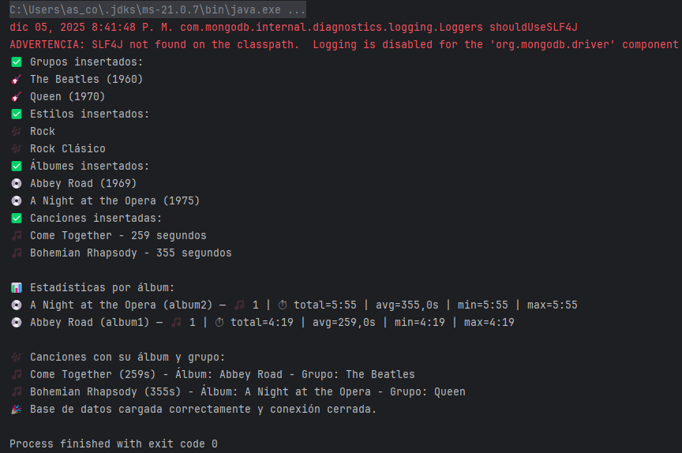

# 🔹Colecciones

En los ejemplos vistos hasta ahora hemos trabajado con una única colección formada por varios documentos.

En bases de datos NoSQL, como MongoDB, es habitual trabajar con varias colecciones para organizar los datos de forma lógica. Aunque NoSQL no soporta joins como SQL, existen estrategias para relacionar colecciones:

1️⃣ **Referencias**:

En este enfoque, los documentos **almacenan solo referencias (IDs) de documentos en otras colecciones**.  
Se usa cuando los datos son reutilizados en múltiples documentos o crecen mucho en tamaño.  


**<u>Ejemplo</u>:** Cliente y Pedidos en colecciones separadas con referencia 

 **Colección `clientes`**

    {
      "_id": 1,
      "nombre": "Juan",
      "email": "juan@email.com",
    }


 **Colección `pedidos`**

En cada pedido guardamos en el campo **cliente_id** el cliente.

    [
      { "_id": 101, "cliente_id": 1, "producto": "Laptop", "total": 1200 }, 
      { "_id": 102, "cliente_id": 1, "producto": "Mouse", "total": 25 }
    ]


2️⃣ **Embebido**:

Este enfoque **anida los datos relacionados dentro del mismo documento**.  
Se usa cuando los datos relacionados se consultan frecuentemente juntos y no crecen demasiado en tamaño.

**<u>Ejemplo</u>:** Cliente con sus Pedidos embebidos

    {
      "_id": 1,
      "nombre": "Juan",
      "email": "juan@email.com",
      "pedidos": [
        { "producto": "Laptop", "total": 1200 },
        { "producto": "Mouse", "total": 25 }
      ]
    }


## 🔹 Relaciones en MongoDB

Aunque **MongoDB** no es relacional, **$lookup** permite combinar datos como si fuera una base de datos relacional (tipo SQL), pero usando su sistema de agregación.

El operador **$lookup** se utiliza en MongoDB para realizar un **join** entre dos colecciones, es decir, para relacionar documentos de diferentes colecciones usando un campo común.

Es útil cuando seguimos un enfoque de **referencias**, donde almacenamos solo el **ObjectId** en lugar de los documentos embebidos.

!!!Note "Sintaxis"
```
    {   
        $lookup: {       
        from: <collection_to_join>,     
        localField: <field_from_the_input_documents>,       
        foreignField: <field_from_collection>,
        as: <output_array_field>     
        }
    }
```
**<u>Ejemplo 1</u>:** Relacionar la coleción Clientes con sus Pedidos

* **Colección `clientes`**  

        [
          { "_id": 1, "nombre": "Carlos", "email": "carlos@example.com" },
          { "_id": 2, "nombre": "Ana", "email": "ana@example.com" }
        ]

* **Colección `pedidos`**

        [
          { "_id": 101, "cliente_id": 1, "producto": "Laptop", "precio": 1200 },
          { "_id": 102, "cliente_id": 1, "producto": "Mouse", "precio": 50 },
          { "_id": 103, "cliente_id": 2, "producto": "Teclado", "precio": 80 }
        ]


* **Consulta** con **`$lookup`** para unir clientes con sus pedidos

        db.clientes.aggregate([
          {
            "$lookup": {
              "from": "pedidos",         // Colección a unir
              "localField": "_id",       // Campo en la colección actual (clientes)
              "foreignField": "cliente_id", // Campo en la otra colección (pedidos)
              "as": "pedidos"            // Nombre del campo de salida con los pedidos
            }
          }
        ])

* **Resultado** esperado

        [
          {
            "_id": 1,
            "nombre": "Carlos",
            "email": "carlos@example.com",
            "pedidos": [
              { "_id": 101, "cliente_id": 1, "producto": "Laptop", "precio": 1200 },
              { "_id": 102, "cliente_id": 1, "producto": "Mouse", "precio": 50 }
            ]
          },
          {
            "_id": 2,
            "nombre": "Ana",
            "email": "ana@example.com",
            "pedidos": [
              { "_id": 103, "cliente_id": 2, "producto": "Teclado", "precio": 80 }
            ]
          }
        ]


**<u>Ejemplo 2</u>**: Realcionar la colección autores con sus libros.

        // Colecciones
      db.createCollection("authors");
      db.createCollection("books");

      // 1) Insertar autor con _id(string)
      db.authors.insertOne({
        _id: "diego",            
        name: "Diego Cortés",
        email: "dcortes@example.com",
        age: 25
      });

      // 2) Insertar libros referenciando el _id del autor
      db.books.insertMany([
        {
          _id: "book-philosopher-stone",
          name: "Philosopher's Stone",
          author_id: "diego"     // ← referencia
        },
        {
          _id: "book-secret-programming",
          name: "Secret of programming",
          author_id: "diego"     // ← referencia
        }
      ]);

      // 3) JOIN con $lookup (authors → books)
      db.getCollection("authors").aggregate([
        {
          $lookup: {
            from: "books",
            localField: "_id",       // "diego"
            foreignField: "author_id",
            as: "books"
          }
        }
      ]);


* **Resultado** esperado

        [
          {
            _id: 'diego',
            name: 'Diego Cortés',
            email: 'dcortes@example.com',
            age: 25,
            books: [
              {
                _id: 'book-philosopher-stone',
                name: "Philosopher's Stone",
                author_id: 'diego'
              },
              {
                _id: 'book-secret-programming',
                name: 'Secret of programming',
                author_id: 'diego'
              }
            ]
          }
        ]


### 🔹 $lookup anidado

Siguiendo con el ejemplo de clientes y sus pedidos, si cada pedido tiene detalles en una tercera colección **detalles_pedido**, podemos anidar otro $lookup:

**<u>Ejemplo</u>:** Relacionar clientes con pedidos y detalles_pedido

* **Colección `clientes`**

        [
          { "_id": 1, "nombre": "Carlos", "email": "carlos@example.com" },
          { "_id": 2, "nombre": "Ana", "email": "ana@example.com" }
        ]

* **Colección `pedidos`**

        [
          { "_id": 101, "cliente_id": 1, "producto": "Laptop", "precio": 1200 },
          { "_id": 102, "cliente_id": 1, "producto": "Mouse", "precio": 50 },
          { "_id": 103, "cliente_id": 2, "producto": "Teclado", "precio": 80 }
        ]

* **Colección `detalles_pedido`**

        [
          { "_id": 201, "pedido_id": 101, "cantidad": 1, "garantia": "2 años" },
          { "_id": 202, "pedido_id": 102, "cantidad": 2, "garantia": "1 año" },
          { "_id": 203, "pedido_id": 103, "cantidad": 1, "garantia": "3 años" }
        ]

* Consulta con **`$lookup` anidado** 

La idea es obtener una lista de clientes con sus pedidos, y dentro de cada pedido, los detalles de ese pedido.

          db.clientes.aggregate([
          {
            "$lookup": {
              "from": "pedidos",
              "localField": "_id",
              "foreignField": "cliente_id",
              "as": "pedidos"
            }
          },
          {
            "$unwind": "$pedidos"  // Descompone el array de pedidos
          },
          {
            "$lookup": {
              "from": "detalles_pedido",
              "localField": "pedidos._id",
              "foreignField": "pedido_id",
              "as": "pedidos.detalles"
            }
          },
          {
            "$group": {
              "_id": "$_id",
              "nombre": { "$first": "$nombre" },
              "email": { "$first": "$email" },
              "pedidos": { "$push": "$pedidos" }
            }
          }
        ])

* **Resultado** esperado

        [
          {
            "_id": 1,
            "nombre": "Carlos",
            "email": "carlos@example.com",
            "pedidos": [
              {
                "_id": 101,
                "cliente_id": 1,
                "producto": "Laptop",
                "precio": 1200,
                "detalles": [
                  { "_id": 201, "pedido_id": 101, "cantidad": 1, "garantia": "2 años" }
                ]
              },
              {
                "_id": 102,
                "cliente_id": 1,
                "producto": "Mouse",
                "precio": 50,
                "detalles": [
                  { "_id": 202, "pedido_id": 102, "cantidad": 2, "garantia": "1 año" }
                ]
              }
            ]
          },
          {
            "_id": 2,
            "nombre": "Ana",
            "email": "ana@example.com",
            "pedidos": [
              {
                "_id": 103,
                "cliente_id": 2,
                "producto": "Teclado",
                "precio": 80,
                "detalles": [
                  { "_id": 203, "pedido_id": 103, "cantidad": 1, "garantia": "3 años" }
                ]
              }
            ]
          }
        ]

---
🎯 **Explicación del Pipeline**


- $lookup (clientes → pedidos): Une los pedidos a cada cliente.
- $unwind (pedidos): Descompone la lista de pedidos para poder hacer otro $lookup.
- $lookup (pedidos → detalles_pedido): Une los detalles a cada pedido.
- $group: Vuelve a agrupar los datos para reconstruir la estructura.

### 🔹El operador `$unwind`
  
El operador **$unwind** en MongoDB descompone un array dentro de un documento en múltiples documentos, cada uno con un solo elemento del array.

Es especialmente útil cuando trabajamos con **$lookup**, porque las consultas de agregación en MongoDB manejan arrays, y a veces es necesario convertirlos en documentos individuales para hacer más joins o transformaciones.

**¿Cuándo se usa $unwind?**  

  ✔ Cuando necesitas descomponer arrays en documentos individuales.  
  ✔ Para hacer joins en múltiples niveles (como unir detalles_pedido a cada pedido).  
  ✔ Para hacer cálculos en elementos individuales de un array, como contar cuántos productos ha comprado un cliente.

!!!Note "Ejemplo sin $unwind"
          db.clientes.aggregate([
            {
              "$lookup": {
                "from": "pedidos",
                "localField": "_id",
                "foreignField": "cliente_id",
                "as": "pedidos"
              }
            }
          ])

      **Resultado**

            [
              {
                "_id": 1,
                "nombre": "Carlos",
                "pedidos": [
                  { "_id": 101, "cliente_id": 1, "producto": "Laptop", "precio": 1200 },
                  { "_id": 102, "cliente_id": 1, "producto": "Mouse", "precio": 50 }
                ]
              },
              {
                "_id": 2,
                "nombre": "Ana",
                "pedidos": [
                  { "_id": 103, "cliente_id": 2, "producto": "Teclado", "precio": 80 }
                ]
              }
            ]

Cada cliente tiene un array con sus pedidos, pero si queremos hacer un segundo $lookup (por ejemplo, para unir detalles de los pedidos), MongoDB no puede unir arrays directamente.

!!!Note "Ejemplo con $unwind"
          db.clientes.aggregate([
            {
              "$lookup": {
                "from": "pedidos",
                "localField": "_id",
                "foreignField": "cliente_id",
                "as": "pedidos"
              }
            },
            {
              "$unwind": "$pedidos"
            }
          ])

      **Resultado**

            [
              {
                "_id": 1,
                "nombre": "Carlos",
                "pedidos": { "_id": 101, "cliente_id": 1, "producto": "Laptop", "precio": 1200 }
              },
              {
                "_id": 1,
                "nombre": "Carlos",
                "pedidos": { "_id": 102, "cliente_id": 1, "producto": "Mouse", "precio": 50 }
              },
              {
                "_id": 2,
                "nombre": "Ana",
                "pedidos": { "_id": 103, "cliente_id": 2, "producto": "Teclado", "precio": 80 }
              }
            ]

Ahora, cada cliente tiene múltiples documentos, uno por cada pedido, lo que permite realizar otro $lookup con detalles_pedido.

----


## 🔹Desde Kotlin

En esta práctica trabajaremos desde IntelliJ con Kotlin, **Jackson y KMongo** para construir un ejemplo completo de varias colecciones en MongoDB sobre información musical. Utilizaremos Jackson (ObjectMapper) para deserializar los ficheros JSON a data classes de Kotlin, y KMongo para conectarnos, insertar, consultar y ejecutar agregaciones (incluyendo $lookup y $unwind). Jackson nos permitirá, además, mapear fácilmente resultados de agregación (documentos BSON) a clases Kotlin mediante convertValue, lo que simplifica mucho el trabajo con pipelines.

**Modelo de datos:**

- **grupos**: contiene información sobre grupos musicales.
- **estilo**: define los distintos estilos musicales (Rock, Jazz, etc.).
- **album**: recoge los discos publicados por los grupos.
- **canciones**: contiene las canciones que forman parte de los álbumes.

Cada colección está relacionada con otras a través de campos que actúan como **referencias**.

**Relación: grupos → estilo**

Cada grupo pertenece a un único estilo musical, representado por el campo estilo_id, que hace referencia al campo _id de la colección estilo.  
Relación **1:N**: un estilo puede estar asociado a varios grupos, pero cada grupo tiene solo un estilo.

        // Colección: grupos
        [
        {
            _id: "grupo1",
            nombre: "The Beatles",
            año_creacion: 1960,
            estilo_id: "estilo1"
        },
        {
            _id: "grupo2",
            nombre: "Queen",
            año_creacion: 1970,
            estilo_id: "estilo2"
        }
        ]

        // Colección: estilo
        [
        {
            _id: "estilo1",
            nombre: "Rock"
        },
        {
            _id: "estilo2",
            nombre: "Rock Clásico"
        }
        ]

**Relación: album → grupos**

Cada álbum pertenece a un grupo concreto. Esto se representa mediante el campo grupo_id, que contiene el _id del grupo.  
Relación **1:N**: un grupo puede tener muchos álbumes, pero cada álbum pertenece a un único grupo.

        // Colección: album
        [
        {
            _id: "album1",
            nombre: "Abbey Road",
            grupo_id: "grupo1",
            año_lanzamiento: 1969
        },
        {
            _id: "album2",
            nombre: "A Night at the Opera",
            grupo_id: "grupo2",
            año_lanzamiento: 1975
        }
        ]

**Relación: canciones → album**

Cada canción pertenece a un álbum, identificado mediante el campo album_id.  
Relación **1:N**: un álbum puede tener muchas canciones, pero cada canción pertenece a un solo álbum.

        // Colección: canciones
        [
        {
            _id: "cancion1",
            nombre: "Come Together",
            album_id: "album1",
            duracion: 259
        },
        {
            _id: "cancion2",
            nombre: "Bohemian Rhapsody",
            album_id: "album2",
            duracion: 355
        }
        ]

**Estrategia para construir la BD**{.azul}

La mejor estrategia para construir la base de datos a partir de archivos JSON es cargar los datos de cada colección desde cada archivo independiente y luego insertarlos en MongoDB usando KMongo o el driver oficial. Así mantienes la separación de datos y facilitas la actualización o migración futura.


1️⃣ Crea un archivo para cada colección:

  - grupos.json

  - estilo.json

  - album.json

  - canciones.json

Los guradaremos en un paquete nuevo llamado **musica** dentro del paquete **kmongo**, que ya teníamos creado:



2️⃣ Creamos un programa main() que lea cada archivo JSON y lo conviérta a una lista de objetos kotlin utilizando la libreia Jackson e insertamos los objetos en MongoDB utilizando KMongo.


    package kmongo.musica

    import com.fasterxml.jackson.module.kotlin.jacksonObjectMapper
    import com.fasterxml.jackson.module.kotlin.readValue
    import org.litote.kmongo.*
    import java.io.File

    // 📦 Data classes
    data class Grupo(val _id: String, val nombre: String, val año_creacion: Int, val estilo_id: String)
    data class Estilo(val _id: String, val nombre: String)
    data class Album(val _id: String, val nombre: String, val grupo_id: String, val año_lanzamiento: Int)
    data class Cancion(val _id: String, val nombre: String, val album_id: String, val duracion: Int)


    val client = KMongo.createClient("mongodb://localhost:27017")
    val database = client.getDatabase("musicaDB")
    val mapper = jacksonObjectMapper()

    fun cargarGrupos() {
        val archivo = File("src/main/kotlin/kmongo/musica/grupos.json")
        val lista: List<Grupo> = mapper.readValue(archivo)

        val coleccion = database.getCollection<Grupo>("grupos")
        coleccion.drop()
        coleccion.insertMany(lista)

        println("✅ Grupos insertados:")
        for (g in lista) println("🎸 ${g.nombre} (${g.año_creacion})")
    }

    fun cargarEstilos() {
        val archivo = File("src/main/kotlin/kmongo/musica/estilo.json")
        val lista: List<Estilo> = mapper.readValue(archivo)

        val coleccion = database.getCollection<Estilo>("estilo")
        coleccion.drop()
        coleccion.insertMany(lista)

        println("✅ Estilos insertados:")
        for (e in lista) println("🎶 ${e.nombre}")
    }

    fun cargarAlbumes() {
        val archivo = File("src/main/kotlin/kmongo/musica/album.json")
        val lista: List<Album> = mapper.readValue(archivo)

        val coleccion = database.getCollection<Album>("album")
        coleccion.drop()
        coleccion.insertMany(lista)

        println("✅ Álbumes insertados:")
        for (a in lista) println("💿 ${a.nombre} (${a.año_lanzamiento})")
    }

    fun cargarCanciones() {
        val archivo = File("src/main/kotlin/kmongo/musica/canciones.json")
        val lista: List<Cancion> = mapper.readValue(archivo)

        val coleccion = database.getCollection<Cancion>("canciones")
        coleccion.drop()
        coleccion.insertMany(lista)

        println("✅ Canciones insertadas:")
        for (c in lista) println("🎵 ${c.nombre} - ${c.duracion} segundos")
    }

    fun main() {
        cargarGrupos()
        cargarEstilos()
        cargarAlbumes()
        cargarCanciones()

        client.close()
        println("🎉 Base de datos cargada correctamente y conexión cerrada.")
    }

**Comprobar  las colecciones desde el shell**{.azul}

    mongosh
    use musicaDB
    show collections
    db.grupos.find().pretty()
    db.album.find().pretty()
    db.canciones.find().pretty()
    db.estilo.find().pretty()

### 🔹 Agregación

Antes de unir colecciones con $lookup, empezaremos con un ejercicio de agregación sobre una única colección de nuestra base de datos musical. Usaremos la colección canciones, que contiene los campos _id, nombre, album_id y duracion. Desde IntelliJ + Kotlin, con Jackson y KMongo, construiremos un pipeline que calcule métricas por album_id sin realizar joins.

El objetivo es afianzar la mecánica del framework de agregación (sin $lookup) para obtener, por cada álbum (referenciado por album_id):

- número de canciones ($sum)
- duración total en segundos ($sum)
- duración media ($avg)
- duración mínima y máxima ($min, $max)

🔹Añade la clase que refleja exactamente lo que proyecta el pipeline: id de álbum, nombre y métricas.

    data class StatsAlbum(
        val album_id: String,
        val album_nombre: String,
        val total_canciones: Int,
        val duracion_total: Int,      // segundos
        val duracion_media: Double,   // ya redondeada a 1 decimal
        val duracion_min: Int,
        val duracion_max: Int
    )

🔹 Añade la función de agregación ($group + $lookup + $unwind + $project + $sort)

    /** 📊 Agregación en UNA colección: estadísticas por álbum (solo 'canciones') */
    fun estadisticasCancionesPorAlbum() {
        val colDocs = database
            .getCollection<Cancion>("canciones")
            .withDocumentClass(Document::class.java)

        val pipeline = listOf(
            // 1) Agrupar en 'canciones' por album_id y calcular métricas
            Document("\$group", Document()
                .append("_id", "\$album_id")
                .append("total_canciones", Document("\$sum", 1))
                .append("duracion_total", Document("\$sum", "\$duracion"))
                .append("duracion_media_raw", Document("\$avg", "\$duracion"))
                .append("duracion_min", Document("\$min", "\$duracion"))
                .append("duracion_max", Document("\$max", "\$duracion"))
            ),
            // 2) Unir con 'album' para obtener el nombre del álbum
            Document("\$lookup", Document()
                .append("from", "album")
                .append("localField", "_id")
                .append("foreignField", "_id")
                .append("as", "album")),
            Document("\$unwind", "\$album"),
            // 3) Proyección final (renombrar, redondear y seleccionar campos)
            Document("\$project", Document()
                .append("_id", 0)
                .append("album_id", "\$_id")
                .append("album_nombre", "\$album.nombre")
                .append("total_canciones", 1)
                .append("duracion_total", 1)
                .append("duracion_min", 1)
                .append("duracion_max", 1)
                .append("duracion_media", Document("\$round", listOf("\$duracion_media_raw", 1)))
            ),
            // 4) Ordenar por más canciones y luego por más duración total
            Document("\$sort", Document("total_canciones", -1).append("duracion_total", -1))
        )

        val resultado = colDocs.aggregate(pipeline)
            .map { d -> mapper.convertValue(d, StatsAlbum::class.java) }
            .toList()

        println("\n📊 Estadísticas por álbum:")
        resultado.forEach { s ->
            println(
                "💿 ${s.album_nombre} (${s.album_id}) — " +
                        "🎵 ${s.total_canciones} | ⏱ total=${mmss(s.duracion_total)} " +
                        "| avg=${"%.1f".format(s.duracion_media)}s " +
                        "| min=${mmss(s.duracion_min)} | max=${mmss(s.duracion_max)}"
            )
        }
    }


🔹Incorporamos la función a main()

    fun main() {
      estadisticasCancionesPorAlbum()
    }  


### 🔹 Consultas con $lookup y $unwind    

Con la base de datos musical ya cargada, vamos a ilustrar cómo consultar datos relacionados en MongoDB usando el pipeline de agregación. En concreto, veremos un ejemplo que:

- Une colecciones con $lookup (p. ej., canciones → album → grupos) para simular un JOIN.

- Normaliza resultados con $unwind cuando el lookup devuelve arrays, transformándolos en documentos planos y fáciles de consumir.

- el nombre de la canción,
- el álbum al que pertenece,
- y el grupo que interpreta ese álbum.

Esto requiere dos niveles de unión:

  canciones → album → grupo


🔹 Añade estas clases adicionales para representar el resultado de la consulta multinivel (anotamos las clases con @JsonIgnoreProperties(ignoreUnknown = true) para que Jackson ignore cualquier campo que no esté declarado):


    import com.fasterxml.jackson.annotation.JsonIgnoreProperties

    @JsonIgnoreProperties(ignoreUnknown = true)
    data class CancionConAlbumYGrupo(
        val _id: String,
        val nombre: String,
        val duracion: Int,
        val album: AlbumConGrupo?
    )

    @JsonIgnoreProperties(ignoreUnknown = true)
    data class AlbumConGrupo(
        val _id: String,
        val nombre: String,
        val año_lanzamiento: Int,
        val grupo: Grupo
    )


🔹 Añade la función **mostrarCancionesConAlbumYGrupo()**

Pega esta función al final del archivo (fuera de main, pero dentro del mismo archivo):

    fun mostrarCancionesConAlbumYGrupo() {
        val resultado = database.getCollection<Cancion>("canciones")
            .aggregate<CancionConAlbumYGrupo>(
                listOf(
                    lookup("album", "album_id", "_id", "album"),
                    unwind("\$album"),
                    lookup("grupos", "album.grupo_id", "_id", "album.grupo"),
                    unwind("\$album.grupo")
                )
            )
            .toList()

        println("\n🎶 Canciones con su álbum y grupo:")
        for (c in resultado) {
            println("🎵 ${c.nombre} (${c.duracion}s) - Álbum: ${c.album.nombre} - Grupo: ${c.album.grupo.nombre}")
        }
    }

🔹 Incorporamos la función a main()

    fun main() {
          mostrarCancionesConAlbumYGrupo()
    }  


### 🔹Programa completo

    package kmongo.musica

    import com.fasterxml.jackson.annotation.JsonIgnoreProperties
    import com.fasterxml.jackson.module.kotlin.jacksonObjectMapper
    import com.fasterxml.jackson.module.kotlin.readValue
    import org.bson.Document
    import org.litote.kmongo.*
    import java.io.File

    // 📦 Data classes
    data class Grupo(val _id: String, val nombre: String, val año_creacion: Int, val estilo_id: String)
    data class Estilo(val _id: String, val nombre: String)
    data class Album(val _id: String, val nombre: String, val grupo_id: String, val año_lanzamiento: Int)
    data class Cancion(val _id: String, val nombre: String, val album_id: String, val duracion: Int)

    @JsonIgnoreProperties(ignoreUnknown = true)
    data class CancionConAlbumYGrupo(
        val _id: String,
        val nombre: String,
        val duracion: Int,
        val album: AlbumConGrupo?
    )

    @JsonIgnoreProperties(ignoreUnknown = true)
    data class AlbumConGrupo(
        val _id: String,
        val nombre: String,
        val año_lanzamiento: Int,
        val grupo: Grupo
    )

    data class StatsAlbum(
        val album_id: String,
        val album_nombre: String,
        val total_canciones: Int,
        val duracion_total: Int,      // segundos
        val duracion_media: Double,   // ya redondeada a 1 decimal
        val duracion_min: Int,
        val duracion_max: Int
    )

    // funicón para formatear segundos a mm:ss
    private fun mmss(seg: Int) = "%d:%02d".format(seg / 60, seg % 60)


    val client = KMongo.createClient("mongodb://localhost:27017")
    val database = client.getDatabase("musicaDB")
    val mapper = jacksonObjectMapper()

    fun cargarGrupos() {
        val archivo = File("src/main/kotlin/kmongo/musica/grupos.json")
        val lista: List<Grupo> = mapper.readValue(archivo)

        val coleccion = database.getCollection<Grupo>("grupos")
        coleccion.drop()
        coleccion.insertMany(lista)

        println("✅ Grupos insertados:")
        for (g in lista) println("🎸 ${g.nombre} (${g.año_creacion})")
    }

    fun cargarEstilos() {
        val archivo = File("src/main/kotlin/kmongo/musica/estilo.json")
        val lista: List<Estilo> = mapper.readValue(archivo)

        val coleccion = database.getCollection<Estilo>("estilo")
        coleccion.drop()
        coleccion.insertMany(lista)

        println("✅ Estilos insertados:")
        for (e in lista) println("🎶 ${e.nombre}")
    }

    fun cargarAlbumes() {
        val archivo = File("src/main/kotlin/kmongo/musica/album.json")
        val lista: List<Album> = mapper.readValue(archivo)

        val coleccion = database.getCollection<Album>("album")
        coleccion.drop()
        coleccion.insertMany(lista)

        println("✅ Álbumes insertados:")
        for (a in lista) println("💿 ${a.nombre} (${a.año_lanzamiento})")
    }

    fun cargarCanciones() {
        val archivo = File("src/main/kotlin/kmongo/musica/canciones.json")
        val lista: List<Cancion> = mapper.readValue(archivo)

        val coleccion = database.getCollection<Cancion>("canciones")
        coleccion.drop()
        coleccion.insertMany(lista)

        println("✅ Canciones insertadas:")
        for (c in lista) println("🎵 ${c.nombre} - ${c.duracion} segundos")
    }


    /** 📊 Agregación en UNA colección: estadísticas por álbum (solo 'canciones') */
    fun estadisticasCancionesPorAlbum() {
        val colDocs = database
            .getCollection<Cancion>("canciones")
            .withDocumentClass(Document::class.java)

        val pipeline = listOf(
            // 1) Agrupar en 'canciones' por album_id y calcular métricas
            Document("\$group", Document()
                .append("_id", "\$album_id")
                .append("total_canciones", Document("\$sum", 1))
                .append("duracion_total", Document("\$sum", "\$duracion"))
                .append("duracion_media_raw", Document("\$avg", "\$duracion"))
                .append("duracion_min", Document("\$min", "\$duracion"))
                .append("duracion_max", Document("\$max", "\$duracion"))
            ),
            // 2) Unir con 'album' para obtener el nombre del álbum
            Document("\$lookup", Document()
                .append("from", "album")
                .append("localField", "_id")
                .append("foreignField", "_id")
                .append("as", "album")),
            Document("\$unwind", "\$album"),
            // 3) Proyección final (renombrar, redondear y seleccionar campos)
            Document("\$project", Document()
                .append("_id", 0)
                .append("album_id", "\$_id")
                .append("album_nombre", "\$album.nombre")
                .append("total_canciones", 1)
                .append("duracion_total", 1)
                .append("duracion_min", 1)
                .append("duracion_max", 1)
                .append("duracion_media", Document("\$round", listOf("\$duracion_media_raw", 1)))
            ),
            // 4) Ordenar por más canciones y luego por más duración total
            Document("\$sort", Document("total_canciones", -1).append("duracion_total", -1))
        )

        val resultado = colDocs.aggregate(pipeline)
            .map { d -> mapper.convertValue(d, StatsAlbum::class.java) }
            .toList()

        println("\n📊 Estadísticas por álbum:")
        resultado.forEach { s ->
            println(
                "💿 ${s.album_nombre} (${s.album_id}) — " +
                        "🎵 ${s.total_canciones} | ⏱ total=${mmss(s.duracion_total)} " +
                        "| avg=${"%.1f".format(s.duracion_media)}s " +
                        "| min=${mmss(s.duracion_min)} | max=${mmss(s.duracion_max)}"
            )
        }
    }

    fun mostrarCancionesConAlbumYGrupo() {
        val pipeline = listOf(
            lookup("album", "album_id", "_id", "album"),
            unwind("\$album"),
            lookup("grupos", "album.grupo_id", "_id", "album.grupo"),
            unwind("\$album.grupo")
        )

        // vista como Document para que aggregate devuelva Document
        val colDocs = database
            .getCollection<Cancion>("canciones")
            .withDocumentClass(Document::class.java)

        val resultado = colDocs
            .aggregate(pipeline)
            .map { doc -> mapper.convertValue(doc, CancionConAlbumYGrupo::class.java) }
            .toList()

        println("\n🎶 Canciones con su álbum y grupo:")
        for (c in resultado) {
            val nombreAlbum = c.album?.nombre ?: "Sin álbum"
            val nombreGrupo = c.album?.grupo?.nombre ?: "Sin grupo"
            println("🎵 ${c.nombre} (${c.duracion}s) - Álbum: $nombreAlbum - Grupo: $nombreGrupo")
        }
    }


    fun main() {
        cargarGrupos()
        cargarEstilos()
        cargarAlbumes()
        cargarCanciones()

        // Agregación en una sola colección
        estadisticasCancionesPorAlbum()
        // Consultas con $lookup y $unwind   
        mostrarCancionesConAlbumYGrupo()

        client.close()
        println("🎉 Base de datos cargada correctamente y conexión cerrada.")
    }


Resultado final:



