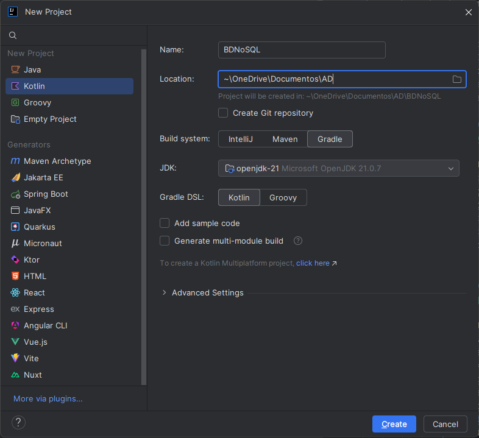
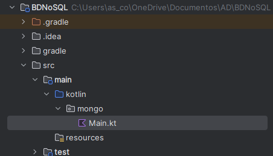
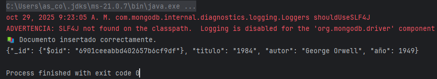
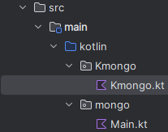
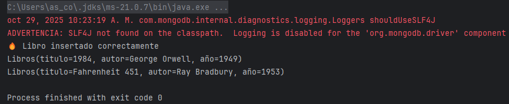

# 🔹Conexión

Para conectar una aplicación escrita en **Kotlin** con una base de datos **MongoDB**, existen dos opciones principales, según el objetivo y el nivel de control que se necesite sobre las operaciones:

1️⃣ Conexión con el controlador oficial de MongoDB (**MongoDB Driver**)

Es la opción más directa y de bajo nivel. Permite trabajar con las clases del paquete com.mongodb o org.bson para realizar operaciones CRUD (crear, leer, actualizar y eliminar) sobre las colecciones.
Se utiliza cuando se quiere tener control total sobre las consultas, la conexión y la conversión de documentos BSON a objetos Kotlin.

2️⃣ Conexión mediante una librería de mapeo (ORM/ODM), como **KMongo**

KMongo es una capa de abstracción sobre el driver oficial, diseñada específicamente para Kotlin.
Permite trabajar con data classes y consultas tipadas, simplificando el código y haciéndolo más idiomático.
Es la opción más recomendada para proyectos educativos o empresariales donde se busca claridad, seguridad de tipos y menor código repetitivo.

A continuación veremos un ejemplo práctico de cada una de las dos formas de conectar Kotlin con MongoDB. Ambos ejemplos se ejecutarán sobre **MongoDB Community Server** en local y se crearán con **Gradle** desde IntelliJ.

3️⃣ Creamos un nuevo proyecto llamado **BDNoSQL**.

## 🔹Kotlin + Gradle + Driver oficial

**1. Añadir las dependencias en Gradle**{.azul}

En el archivo **build.gradle.kts**, dentro del bloque dependencies, añadimos:

        dependencies {
            implementation("org.mongodb:mongodb-driver-sync:5.2.0")
        }

**2. Ejemplo sobre la colección Libros**{.azul}
    
Crea un archivo **main.kt** en un paquete nuevo llamado **mongo** con el siguiente código:

    import com.mongodb.client.MongoClients
    import com.mongodb.client.MongoCollection
    import com.mongodb.client.MongoDatabase
    import org.bson.Document

    fun main() {
        // 1Conexión al servidor local
        val uri = "mongodb://localhost:27017"
        val client = MongoClients.create(uri)

        // Seleccionar base de datos
        val database: MongoDatabase = client.getDatabase("biblioteca")

        // Seleccionar colección
        val coleccion: MongoCollection<Document> = database.getCollection("libros")

        // Insertar un documento
        val doc = Document("titulo", "1984")
            .append("autor", "George Orwell")
            .append("año", 1949)

        coleccion.insertOne(doc)
        println("Documento insertado correctamente.")

        // Leer documentos
        for (libro in coleccion.find()) {
            println(libro.toJson())
        }

        client.close()
    }

!!!Warning "Advertencia"
    Al ejecutar el programa os aparecerá el siguiene mensaje:

     

    Esto no es un error, solo una advertencia. MongoDB intenta usar **SLF4J** (Simple Logging Facade for Java) para mostrar mensajes de registro (logs) sobre la conexión, operaciones, etc.  
    Como tu proyecto no incluye ninguna librería de logging, te avisa de que no podrá mostrar esos logs internos, pero el programa sigue funcionando perfectamente.
   

## 🔹Kotlin + Gradle + KMongo

**1. Añadir las dependencias en Gradle**{.azul}

En el **archivo build.gradle.kts**, dentro del bloque dependencies, añadimos:

        dependencies {
            implementation("org.litote.kmongo:kmongo:5.1.0")
        }

**2. Ejemplo sobre la colección Libros**{.azul}

   
Crea un archivo **main.kt** en un paquete nuevo llamado **kmongo** con el siguiente código:

        import org.litote.kmongo.*

        data class Libros(val titulo: String, val autor: String, val año: Int)

        fun main() {
            // Crear conexión
            val client = KMongo.createClient() // Por defecto: mongodb://localhost:27017
            val database = client.getDatabase("biblioteca")
            val coleccion = database.getCollection<Libros>()

            // Insertar datos
            val libro = Libros("Fahrenheit 451", "Ray Bradbury", 1953)
            coleccion.insertOne(libro)
            println("Libro insertado correctamente")

            // Consultar datos
            val resultados = coleccion.find()
            resultados.forEach { println(it) }
        
            client.close()
        }

!!!Note "Nota"
    Aparecerán los dos libros insertados, tanto en el ejemplo anterior como en este, ya que la colección Libros es la misma.

    

## 🔹Control de errores 

Cuando un programa se conecta a una base de datos como MongoDB, siempre existe la posibilidad de que ocurran errores: la base de datos puede no estar disponible, los datos pueden ser incorrectos o una operación puede fallar por un conflicto o por formato inválido.

Por eso, es importante incluir control de errores en el código, especialmente en las operaciones de conexión y en las operaciones CRUD (insertar, leer, actualizar, eliminar).

El control de errores se hace con bloques **try-catch**. Así puedes capturar las excepciones y evitar que el programa se detenga bruscamente.

**Buenas prácticas:**

- Verificar que el servidor MongoDB está en ejecución antes de conectar.
- Usar **try-catch** en las secciones críticas del programa (especialmente conexión e inserción).
- Mostrar mensajes claros al usuario para facilitar el diagnóstico.
- Cerrar el cliente con client.close() en un bloque **finally** si se usa una conexión persistente.

        try {
            val client = KMongo.createClient() // Por defecto: mongodb://localhost:27017
            val database = client.getDatabase("biblioteca")
            val coleccion = database.getCollection<Libros>()

            // Insertar datos
            val libro = Libros("Fahrenheit 451", "Ray Bradbury", 1953)
            coleccion.insertOne(libro)
            println("Libro insertado correctamente")

            // Consultar datos
            val resultados = coleccion.find()
            resultados.forEach { println(it) }
        
            client.close()

        } catch (e: Exception) {
            println("⚠️ Error al acceder a MongoDB: ${e.message}")
        
        } finally { //si se usa una conexión persistente.
            // Cierre seguro del cliente
            client?.close()
            println("🔒 Conexión cerrada.")
        }    
    

## 🔹Construir una base de datos MongoDB

Existen principalmente dos maneras de crear y poblar una base de datos en MongoDB:

**1.  Inserción manual de documentos**{.azul}

Podemos crear los documentos directamente desde la consola de MongoDB o desde un programa,
utilizando instrucciones **insertOne()** o **insertMany()** con los datos escritos a mano.

Por ejemplo: Insertar un película en una colección llamada peliculas.

    db.peliculas.insertOne({
        "titol": "La noia terrible",
        "director": "Michael Verhoeven",
        "genere": "Drama",
        "any": 1990
    })

!!!Warning ""
    Este método es útil para hacer pruebas rápidas o añadir registros sueltos, pero no resulta práctico cuando tenemos muchos datos.

**2.  Lectura desde un archivo JSON**{.azul}

Cuando ya disponemos de un conjunto de datos estructurados (por ejemplo, en un **archivo json**),
podemos leer el archivo desde un programa y **convertir cada elemento en un documento MongoDB**.
Esto permite crear colecciones completas de forma automática, sin escribir los documentos uno a uno.
A partir de este archivo, un programa en Kotlin puede leer los datos y añadirlos automáticamente
a una colección MongoDB mediante las funciones insertOne() o insertMany().

En este ejemplo veremos cómo crear una base de datos MongoDB, utilizando el controlador **KMongo**, a partir de un archivo JSON llamado
**[peliculas.json](peliculas.json)**, que ubicaremos en un paquete nuevo llamado **peliculas**, dentro del paquete **kmongo** (**src/main/kotlin/kmongo/peliculas/**).

Vamos a desarrollar dos programas equivalentes, pero utilizando dos librerías diferentes para el tratamiento de los datos JSON:
**kotlinx.serialization** y **Jackson**.

Ambos programas trabajarán con el mismo archivo de datos **[peliculas.json](peliculas.json)**, y realizarán exactamente los mismos pasos:

- Lee el archivo JSON.
- Convertir los datos leídos en una lista de objetos de la clase Pelicula.
- Insertar los objetos en una colección de MongoDB llamada peliculas, utilizando la librería **KMongo**, que permite trabajar directamente con clases de datos Kotlin (data class).
- Recupera y muestra los datos almacenados en la colección.  

--

**🔹Estructura del archivo JSON**

        [
        {
            "titol": "La noia terrible",
            "titol_or": "Das schreckliche Mädchen",
            "director": "Michael Verhoeven",
            "genere": "Drama",
            "durada": 93,
            "any": 1990,
            "actors": ["Lena Stolze", "Hans-Reinhard Müller", "Monika Baumgartner"],
            "sinopsi": "Una noia alemanya que viu a Passau inicia una investigació sobre el passat..."
        },
        {
            "titol": "Hardcore",
            "titol_or": null,
            "director": "Paul Schrader",
            "genere": "Comedia",
            "durada": 109,
            "any": 1979,
            "actors": ["Peter Boyle", "George C. Scott", "Season Hubley"],
            "sinopsi": "Un home profundament religiós contracta un detectiu per trobar la seua filla..."
        }
        ]

**🔹Estructura del proyecto**

        PeliculasMongo/
        ├─ build.gradle.kts
        ├─ src/
        │   └─ main/
        │       └─ kotlin/
        │           └─ kmongo/
        │               └─ peliculas/
        │                   ├─ MainSerialization.kt      → programa con kotlinx.serialization
        │                   └─ MainJackson.kt            → programa con Jackson
                            └─ peliculas.json            → archivo con las películas

**🔹Programa utilizando kotlinx.serialization**: MainSerialization.kt

    package kmongo.peliculas

    import kotlinx.serialization.Serializable
    import kotlinx.serialization.builtins.ListSerializer
    import kotlinx.serialization.json.Json
    import org.litote.kmongo.KMongo
    import org.litote.kmongo.getCollection
    import java.io.File

    @Serializable
    data class Pelicula(
        val titol: String = "",
        val titol_or: String? = null,
        val director: String = "",
        val genere: String = "",
        val durada: Int = 0,
        val any: Int = 0,
        val actors: List<String>? = null,
        val sinopsi: String = ""
    )

    fun main() {
        val ruta = "src/main/kotlin/kmongo/peliculas/peliculas.json"
        val archivo = File(ruta)

        if (!archivo.exists()) {
            println("❌ No se ha encontrado el archivo $ruta")
            return
        }

        println("📖 Leyendo archivo $ruta ...")

        try {
            // 1Leer y deserializar las películas con kotlinx.serialization
            val json = Json { ignoreUnknownKeys = true }
            val peliculas: List<Pelicula> = json.decodeFromString(
                ListSerializer(Pelicula.serializer()),
                archivo.readText(Charsets.UTF_8)
            )

            println("✅ Se han leído ${peliculas.size} películas del archivo.")

            // Conexión a MongoDB con KMongo
            val cliente = KMongo.createClient("mongodb://localhost:27017")
            val bd = cliente.getDatabase("peliculas_db")
            val coleccion = bd.getCollection<Pelicula>()

            // Limpiar colección
            coleccion.drop()

            // Insertar todas las películas directamente (sin Document)
            coleccion.insertMany(peliculas)
            println("${peliculas.size} películas insertadas correctamente.\n")

            // Consultar y mostrar todas
            val lista = coleccion.find().toList()
            println("Contenido de la colección en MongoDB:\n")

            var i = 1
            for (p in lista) {
                println("🎞️ $i. ${p.titol} (${p.any})")
                println("   🎬 Director: ${p.director}")
                println("   🧩 Género: ${p.genere}")
                println("   ⏱️ Duración: ${p.durada} min")
                if (p.actors != null) println("   👥 Actores: ${p.actors.joinToString(", ")}")
                println("   📝 Sinopsis: ${p.sinopsi.take(100)}...")
                println("---------------------------------------------------------")
                i++
            }
    /*
            // Ejemplo de consulta: solo dramas ordenados por título
            val dramas = coleccion.find(Pelicula::genere eq "Drama").sortedBy { it.titol }

            println("\n --- Películas de género 'Drama' ---\n")
            for (p in dramas) {
                println("${p.titol} - ${p.director} (${p.any})")
            }
    */
            cliente.close()
            println("\n Proceso finalizado correctamente.")

        } catch (e: Exception) {
            println("❌ Error durante la ejecución: ${e.message}")
            e.printStackTrace()
        }
    }

**🔹Programa utilizando Jackson**: MainJackson.kt

    package kmongo.peliculas

    import com.fasterxml.jackson.module.kotlin.jacksonObjectMapper
    import com.fasterxml.jackson.module.kotlin.readValue
    import org.litote.kmongo.KMongo
    import org.litote.kmongo.eq
    import org.litote.kmongo.getCollection
    import java.io.File
    import org.litote.kmongo.Id
    import org.litote.kmongo.newId

    data class Pelicula2(
        val _id: Id<Pelicula> = newId(),
        val titol: String = "",
        val titol_or: String? = null,
        val director: String = "",
        val genere: String = "",
        val durada: Int = 0,
        val any: Int = 0,
        val actors: List<String>? = null,
        val sinopsi: String = ""
    )

    fun main() {
        val ruta = "src/main/kotlin/kmongo/peliculas/peliculas.json"
        val archivo = File(ruta)

        if (!archivo.exists()) {
            println("❌ No se ha encontrado el archivo $ruta")
            return
        }

        println("📖 Leyendo archivo $ruta ...")

        try {
            // Crear el mapper de Jackson
            val mapper = jacksonObjectMapper()

            // Leer el archivo y convertirlo en lista de Pelicula
            val peliculas: List<Pelicula2> = mapper.readValue(archivo)

            println("✅ Se han leído ${peliculas.size} películas del archivo.")

            // Conectarse a MongoDB con KMongo
            val cliente = KMongo.createClient("mongodb://localhost:27017")
            val baseDatos = cliente.getDatabase("peliculas_db")
            val coleccion = baseDatos.getCollection<Pelicula2>()

            // Limpiar colección (opcional)
            coleccion.drop()

            // Insertar todas las películas de golpe
            coleccion.insertMany(peliculas)
            println(" ${peliculas.size} películas insertadas correctamente.\n")

            // Mostrar todas las películas
            val lista = coleccion.find().toList()
            println(" Contenido de la colección en MongoDB:\n")
            var i = 1
            for (p in lista) {
                println("🎞️ $i. ${p.titol} (${p.any})")
                println("   🎬 Director: ${p.director}")
                println("   🧩 Género: ${p.genere}")
                println("   ⏱️ Duración: ${p.durada} min")
                if (p.actors != null) println("   👥 Actores: ${p.actors.joinToString(", ")}")
                println("   📝 Sinopsis: ${p.sinopsi.take(100)}...")
                println("---------------------------------------------------------")
                i++
            }

            // Consultar solo los dramas, ordenados por título
            println("\n --- Películas de género 'Drama' ---\n")
            val dramas = coleccion.find(Pelicula::genere eq "Drama").sortedBy { it.titol }
            for (p in dramas) {
                println("${p.titol} - ${p.director} (${p.any})")
            }

            cliente.close()
            println("\n Proceso finalizado correctamente.")

        } catch (e: Exception) {
            println("❌ Error durante la ejecución: ${e.message}")
            e.printStackTrace()
        }
    }

**🔹Salida esperada:**

