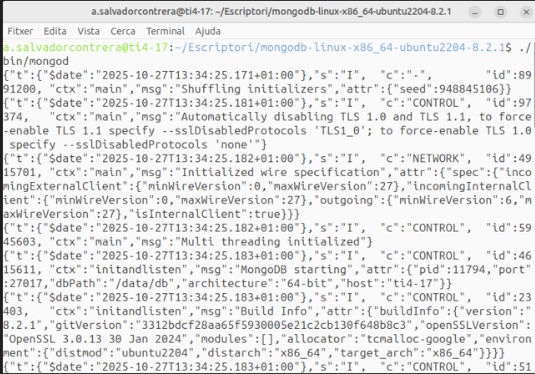
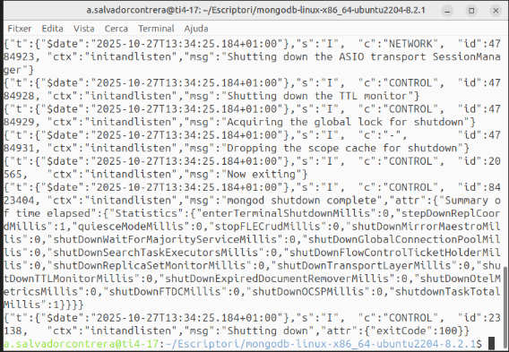
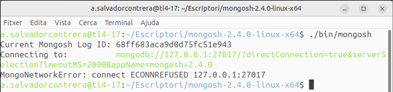
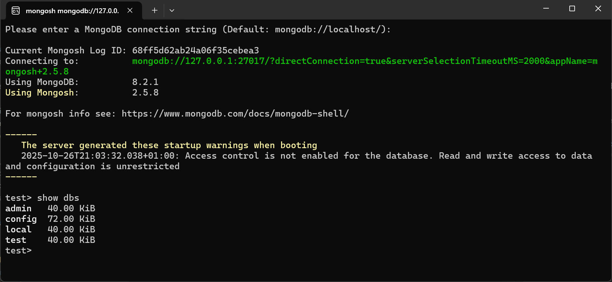
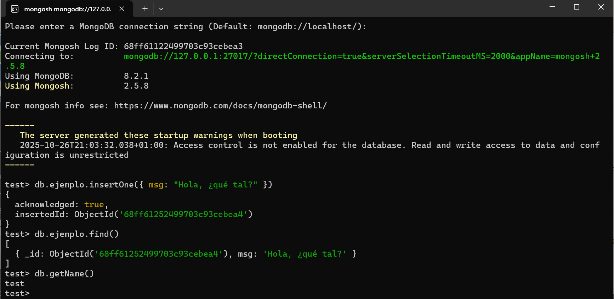

# Instalación

Hoy en día existen múltiples opciones para trabajar con MongoDB, tanto a nivel de instalación como de desarrollo y administración.
Aquí tienes un resumen actualizado, organizado por categorías 👇

⚙️ **1. Opciones de instalación y despliegue**

| Opción | Descripción | Ideal para |
|--------|--------------|-------------|
| 🖥️ **MongoDB Community Server** | Versión gratuita que se instala localmente en Windows, Linux o macOS. | Prácticas locales, entornos educativos. |
| 🐳 **MongoDB en Docker** | Se ejecuta como contenedor con `docker-compose` o comandos `docker run`. | Entornos de desarrollo rápidos y reproducibles. |
| ☁️ **MongoDB Atlas** | Servicio en la nube oficial de MongoDB. Permite crear clústeres gratuitos o de pago, gestionados por Mongo. | Proyectos web, microservicios, despliegues reales. |
| 🧩 **MongoDB Local + Atlas Sync** | Permite sincronizar datos locales con una base remota en Atlas. | Aplicaciones con modo offline/online. |

💻 **2. Herramientas de administración y visualización**

| Herramienta | Tipo | Descripción |
|--------------|------|--------------|
| 🧭 **MongoDB Compass** | GUI oficial | Interfaz gráfica para consultar, insertar y analizar datos. |
| 🐘 **DBeaver** | GUI universal | Permite conectarse a Mongo y a otras bases de datos (SQL y NoSQL). |
| 🧑‍💻 **Robo 3T** *(antiguo Robomongo)* | GUI ligera | Muy utilizada para tareas básicas de exploración. |
| 📜 **mongosh** | Consola oficial | Shell de comandos moderno (sustituye a `mongo`). |

!!!Note ""
    🎯 De entre todas las opciones posibles para instalar y administrar MongoDB, hemos elegido utilizar la versión **Community** junto con **Mongo Shell (mongosh)** por su simplicidad, ligereza y adecuación a los objetivos de esta unidad.

## 🐧 Instalación en Linux

Para realizar la instalación más básica, podemos hacerlo sin permisos de administrador.
Si los tenemos, todo será más cómodo, pero si no, también es posible, como veremos y destacaremos a continuación.

⚙️ **Instalación del servidor (Linux)**{.azul}

Desde la página oficial de MongoDB: [https://www.mongodb.com/try/download/community
](https://www.mongodb.com/try/download/community) vamos al menú **Products → Community Edition → Community Server** y descargamos la versión apropiada para nuestro sistema operativo.

Observa que, en el caso de Linux, hay muchas versiones para distintas distribuciones.
Es recomendable elegir el paquete **.tgz**, ya que simplemente descomprimiendo el archivo se completa la instalación básica.

Por ejemplo, para Ubuntu 22.04 de 64 bits, en el momento de redactar estos apuntes, el archivo sería: [https://fastdl.mongodb.org/linux/mongodb-linux-x86_64-ubuntu2204-8.2.1.tgz](https://fastdl.mongodb.org/linux/mongodb-linux-x86_64-ubuntu2204-8.2.1.tgz)

!!!Warning ""
    Recuerda comprobar siempre que la versión coincide con la de tu sistema operativo.

Sencillamente, descomprimiremos este archivo en el lugar que queramos, y con eso ya tendremos la instalación básica lista.

📁 Una vez instalado, crearemos el directorio de datos, que por defecto ha de estar ubicado en la raiz de la instalación:

    mkdir /data  
    mkdir /data/db

El único problema que podríamos tener, si no somos administradores, es no tener permiso para crear ese directorio.
En ese caso, crearemos otro directorio alternativo y, en el momento de arrancar el servidor, le indicaremos esa ubicación.

▶️ La forma de arrancar el servidor será:

    <directoro raíz de MongoDB>./bin/mongod

Opcionalmente, podemos indicarle a MongoDB dónde se encuentra la base de datos (si no lo especificamos, asumirá por defecto que está en /data/db):

    <directorio raíz de MongoDB>./bin/mongod --dbpath <directorio_de_la_BD>

Una vez arrancamos el servidor, y si todo es correcto, aparecerán una serie de mensajes informativos y el servidor quedará en espera de recibir peticiones del cliente:

||
-----|-----

!!!Note "Nota"
    Una vez que el servidor está en marcha, no debemos cerrar esa terminal, ya que al hacerlo detendríamos el servidor.

⚙️ **Instalación del cliente MongoShell (Linux)**{.azul}

Desde la página de MongoDB [https://www.mongodb.com/try/download/shell
](https://www.mongodb.com/try/download/shell) vamos al menú
**Products → Tools → MongoDB Shell**, y descargamos la versión apropiada para nuestro sistema operativo.

Observa que, en el caso de Linux, existen muchas versiones para diferentes distribuciones.
Es recomendable elegir el paquete **.tgz**, ya que simplemente descomprimiendo el archivo se completa la instalación.

En el caso de Ubuntu 22.04 de 64 bits, seleccionaremos la opción genérica “Linux 64”, ya que es la que ofrece el paquete .tgz.

El archivo correspondiente es: [https://downloads.mongodb.com/compass/mongosh-2.4.0-linux-x64.tgz](https://downloads.mongodb.com/compass/mongosh-2.4.0-linux-x64.tgz)

!!!Warning ""
    Recuerda asegurarte siempre de que la versión sea la correcta para tu sistema.

Sencillamente descomprimiremos este archivo en el lugar que queramos, y con eso ya tendremos hecha la instalación básica.

▶️ La forma de arrancar el cliente será:

    <directori raíz de  Mongosh>./bin/mongosh

    

## 🪟 Instalación en Windows

⚙️ **Instalación del servidor (Windows)**{.azul}

Desde la página oficial de MongoDB: [https://www.mongodb.com/try/download/community](https://www.mongodb.com/try/download/community) vamos al menú **Products → Community Edition → Community Server** y descargamos la versión apropiada para nuestro sistema operativo, que se distribuye como un archivo **.msi** ejecutable.

🔽En el momento de redactar estos apuntes, la versión de 64 bits más reciente: [https://fastdl.mongodb.org/windows/mongodb-windows-x86_64-8.2.1-signed.msi](https://fastdl.mongodb.org/windows/mongodb-ewindows-x86_64-8.2.1-signed.msi)

Durante la instalación, se te preguntará si deseas instalarlo como un servicio. Si eliges esta opción, el programa se iniciará automáticamente con el sistema y no tendrás que ejecutarlo manualmente cada vez.

🎯Si instalaste MongoDB como servicio, se inicia automáticamente al arrancar Windows, puedes comprobarlo con:

    net start | find "MongoDB"

!!!Note "Nota" 
    Si eliges **no** instalar MongoDB como servicio, deberás iniciarlo manualmente cada vez que quieras usarlo. En este caso, es necesario crear la carpeta donde se almacenarán los datos de la base de datos.

<!--
Si todo es correcto, debería aparecer una ventana o consola indicando que el servidor está en ejecución, como en la siguiente imagen:

-->

💻 **Instalación del cliente Mongo Shell (Windows)**{.azul}

Para conectarnos como clientes, debemos hacerlo desde un  terminal, utilizando mongosh.exe, que es la interfaz de línea de comandos (CLI) oficial de MongoDB.

Esta herramienta permite interactuar con la base de datos mediante comandos en JavaScript.

🔽Descargamos la versión correspondiente de MongoDB Shell para Windows desde la página oficial: [https://www.mongodb.com/try/download/shell](https://www.mongodb.com/try/download/shell)

🔽En el momento de redactar estos apuntes, la versión de 64 bits más reciente: [https://downloads.mongodb.com/compass/mongosh-2.5.8-x64.msi](https://downloads.mongodb.com/compass/mongosh-2.5.8-x64.msi)

Una vez el servidor esté activo, simplemente escribe:

    mongosh

Dentro del shell, prueba con:

    show dbs

Si ves las bases de datos (admin, config, local), todo está funcionando correctamente:

!!!Tip "Mongo Compass"
    También podéis descargar la versión **MongoDB Compass**, que es la herramienta gráfica oficial de MongoDB, la cual permite visualizar, explorar y administrar bases de datos MongoDB sin necesidad de utilizar la línea de comandos.

    [https://downloads.mongodb.com/compass/mongodb-compass-1.45.3-win32-x64.exe](https://downloads.mongodb.com/compass/mongodb-compass-1.45.3-win32-x64.exe)

**Probar el funcionament**{.azul}

Para probar su funcionamiento, vamos a ejecutar un par de comandos: uno para guardar un documento y otro para recuperarlo.

En cualquier operación, debemos escribir db seguido del nombre de la colección, y después la operación que queremos realizar.
Con el siguiente comando:

    db.ejemplo.insertOne({ msg: "Hola, ¿qué tal?" })

Nos responderá con:

        {
        acknowledged: true,
        insertedId: ObjectId('68ff6004ab24a06f35cebea4')
        }

Indicando que se ha insertado un documento en la **colección ejemplo** (si no existía, la creará automáticamente).

Y con el siguiente comando recuperamos la información:

    db.ejemplo.find()

Lo que nos devolverá algo como:

    { "_id" : ObjectId("56cc1acd73b559230de8f71b"), "msg" : "Hola, ¿qué tal?" }

Todo esto se realiza en la misma terminal, y cada uno de nosotros obtendrá un número diferente en el campo **ObjectId**.
En la siguiente imagen pueden verse las dos operaciones.

En realidad, estamos conectados a una base de datos llamada test.
Podemos crear y utilizar más de una base de datos, pero en este curso será más que suficiente trabajar con esta.

Para comprobarlo, podemos ejecutar la siguiente instrucción, que nos devuelve **el nombre de la base de datos actual**:

    db.getName()